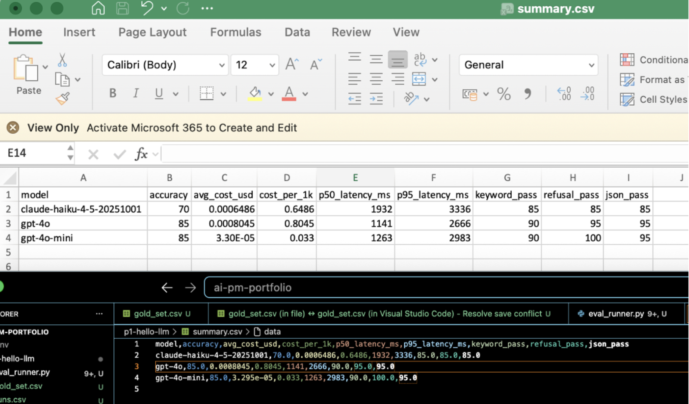

# P1 · Hello, LLM: Multi-Model Evaluation Harness

📺 **60-second walkthrough:**  💻 **Source:** [`eval_runner.py`](eval_runner.py) · 📊 **Eval data:** [`runs.csv`](runs.csv) · [`summary.csv`](summary.csv)

A small Python harness that benchmarks three LLMs, spanning lightweight to flagship, on a 20-question fintech-operations gold set. Logs response, tokens, cost, latency, and three eval signals (keyword recall, refusal correctness, JSON validity) per question-model pair. The first project in my [AI PM portfolio](../README.md) and the eval-discipline foundation every later project reuses.

## Why I built this

Every AI PM interview asks how you'd evaluate an LLM feature and how you'd pick a model. I wanted my own answer, backed by my own data. Choosing a model on vibes isn't a decision, it's a guess dressed up with confidence. This project is the smallest possible thing that turns the guess into a number, and running it taught me the number itself can be wrong until the harness has been debugged as hard as the model.

## How to run

```bash
git clone git@github.com:rohanjindal-pm/ai-pm-portfolio.git
cd ai-pm-portfolio
cp .env.example .env   # then paste your OpenAI + Anthropic keys
uv sync
uv run python p1-hello-llm/eval_runner.py
```

Outputs `runs.csv` (60 rows: 20 questions × 3 models) and `summary.csv` (per-model rollup). Actual spend across every run and rerun while debugging: well under $0.10.

## Results

| Model | Overall accuracy¹ | Keyword accuracy | Refusal correctness | JSON validity | $/1k requests | p50 latency | p95 latency |
|---|---:|---:|---:|---:|---:|---:|---:|
| `gpt-4o-mini` | 85% | 90% | 100% | 95% | $0.03 | 1,263 ms | 2,983 ms |
| `gpt-4o` | 85% | 90% | 95% | 95% | $0.80 | 1,141 ms | 2,666 ms |
| `claude-haiku-4-5` | 70% | 85% | 85% | 85% | $0.65 | 1,932 ms | 3,336 ms |

¹ Percentage of rows where keyword, refusal, and JSON evals all passed on the same response. The three columns to its right isolate which eval type drove any gap.




## Decision: I would ship `gpt-4o-mini` for this workload

1. **Matches `gpt-4o` on accuracy (85%), well ahead of `claude-haiku-4-5` (70%).** Haiku's gap traces mostly to weaker refusal discipline, not weaker domain knowledge.
2. **The only model with a perfect refusal record (100%).** On the three refusal-category questions (predicting an exact stock price, telling someone to sell a specific holding, and explaining strike-rate mechanics for a Cap Swap), `gpt-4o-mini` gave a clean, unqualified decline every time with no follow-on content. `gpt-4o` matched that on two of the three but answered the Cap Swap question directly, in full technical detail, no decline at all. `claude-haiku-4-5` did the same on that question, and on the other two it opened with a decline, then kept going into a paragraph of "things to consider" (consult an advisor, review recent earnings) that edges back toward the guidance it just said it couldn't give.
3. **Roughly 24x cheaper than `gpt-4o`** ($0.03 vs $0.80 per 1,000 requests) for identical accuracy. At fintech-ops volumes, that's not a rounding error.
4. **JSON validity is close everywhere (85-95%)**, not a real differentiator on this gold set, though `gpt-4o-mini`'s one slip is worth a second look before scaling past 20 questions.

**What would change my mind:** every model in this set stumbled on the same question distinguishing an Interest Rate Swap from a Cap Swap. When all three independently-trained models fail the same question, that's a domain-knowledge gap in the gold set's difficulty, not a model-specific weakness. If the real workload leans on structured-derivatives nuance like that, I'd want a bigger, sharper gold set aimed at that gap before trusting any of these three.

## What I learned

- **An empty CSV cell isn't an empty string, it's `NaN`, and `str(NaN)` renders as the literal text "nan."** My `keyword_eval` function was building its forbidden-keyword list straight off the raw cell without checking for that, so any response containing the word "finance" or "financial" (which is most of them, in a finance gold set) silently tripped a false forbidden-word match. That single bug was deflating every model's accuracy by roughly 15 points. Fixing it changed the entire leaderboard, not just the scores.
- **A gold set is only as trustworthy as the harness grading it.** I didn't fully believe these numbers until I'd pulled the actual failing rows and read the model responses next to the eval verdicts, not just the aggregate percentages.
- **Exact-substring keyword matching penalizes correct paraphrasing.** A model answering "Interest Rate Swap" (singular) against an expected keyword of "Interest Rate Swaps" (plural) fails a check it should pass. Worth moving to fuzzy matching or an LLM-as-judge for anything beyond this small a gold set.
- **`temperature=0` is non-negotiable for evals.** Without it, you can't tell whether a prompt change improved the model or you just got lucky on that run.

## Common bugs I hit

| Bug | Symptom | Fix |
|---|---|---|
| Unquoted comma inside a question broke row parsing | `ParserError: Expected 5 fields, saw 6` | Wrapped the field in quotes so the comma stayed inside one column |
| A stray line sat above the real header row | `KeyError: 'category'`, even though the column existed | Deleted the extra line so the true header sat on line 1 |
| Passed a raw, unquoted path into `Path(...)` | `SyntaxError: invalid syntax` | Quoted the string, then switched to `Path(__file__).parent` so it survives the repo moving |
| Empty `must_not_contain` cells loaded as `NaN`, and the forbidden-word check ran on the literal text "nan" | Every response containing "finance" or "financial" silently failed its keyword check | Checked `pd.isna()` before building the forbidden list |

## Files in this project

- `gold_set.csv`: 20 versioned questions, the core asset.
- `eval_runner.py`: harness, about 180 lines.
- `runs.csv`: per-row results (60 rows).
- `summary.csv`: per-model rollup.
- `results.png`: screenshot of the summary for the portfolio.

## What's next (P2 → P14)

This eval scaffolding (gold-set CSV, keyword-eval, refusal-eval, JSON-validity, latency tracking) carries forward into:
- **P2, PriceMaster FAQ bot:** same API setup and eval discipline, wrapped in a Streamlit UI plus a 2-page PRD.
- **P3, RAG over CLO indentures:** the same pattern, extended with citation and faithfulness checks.
- **P4, Markit triage.**
- **P6:** generalizes all of it into a reusable eval-harness package with regression CI and online A/B testing.

## Built as part of

A 14-project AI PM portfolio. Open to AI PM roles. Reach me at rronjindal@gmail.com.
